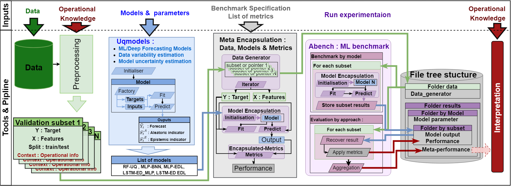

# disentangled-Uncertainty-Quantification

The codebase accompanies the paper entitled: *"Disentangled Predictive Uncertainty framework for Time Series Data"*. It discusses about distangled Uncertainty quantification and propose an expermental methodology to prove the effectiveness of dUQ for metamodels approchs (as Random forest with dUQ, Probabilistic Neural Netorwork with MC Dropout and Probabilistic Neural Netorwork with deep ensemble)

This Git show an application of two futur open source library Uqmodels + Abench components apply on two dataset. It aim to produce monitoring assets based on regression models that perform decomposed uncertainty quantification to produce 3 indicators and combine then to design confidence indicators.

*- Prediction
*- Aleatoric indicator (Cracterising data irreducible variabiliy)
*- Espistemic indicators (Caracterising model confidence)



## Installation

First install virtualenv and create a virtual environment:
```bash
# Install virualenv
pip install virtualenv
# Create virtual environment
virtualenv experiments
# Activate virtual environment
# For example, under Mac OS / Linux
source experiments/bin/activate
```

Then install package and requirements:

```bash
pip install -r requirements.txt

To use jupyter notebooks, make sure to run the following command:
```
```bash
python -m ipykernel install --user --name=experiments
```

## Structure

* `data/` : 
    - `data.air_liquide_data `: Contain our gas demand forecasting dataset.
    - `data.Public_dataset`: Contain the small public dataset used to evaluate standars performance of our baseline -> We remove year_prediction.csv due to it large size (~400Mo)
    - `data.synthetic_data`: Contain our Synthetic forecasting dataset based on times-dependent local normal law.

* `src/` :
    - `abench` : source of a futur public library aiming to perform Agnostics benchmark.
    - `puncc` : predictive uncertainty calibration and conformalization package.
    - `attack_function.py ` : source link to variability injection
    - ` Benchmark_UQ.py` : source and wrapper to specify the dUQ-task to abench.

* `notebook/` :   
    - ` Benchmark_public_dataset.ipynb `: Models hyperparameters and Benchmark procedures for Public datasets
    - ` Benchmark_var_distangle_real.ipynb `: Models hyperparameters, Inference and learning variability injections, Benchmark initialization and benchmark process for our real dataset.
    - `Benchmark_var_distangle_syn.ipynb `: Models hyperparameters, Inference and learning variability injections, Benchmark initialization and benchmark process for our synthetic dataset
    - `Analyse_learning_injection_results.ipynb ` : Results recovery and visualisation for learning variability injection experiments
    - `Analyse_inference_injection_results.ipynb ` : Results recovery and visualisation for inference variability injection experiments
    
* `results/` : Cross validated data and models results generated by abench.
    - `Benchmark_public ` : UQ-regression experiments on public dataset
    - `Benchmark_real_injection_inference` : dUQ inference variability injection on our real dataset
    - `Benchmark_real_injection_learning` : dUQ learning variability injection on our real dataset
    - `Benchmark_synthetic_injection_inference` : dUQ inference variability injection on our synthetic dataset
    - `Benchmark_synthetic_injection_learning` : dUQ learning variability injection on our synthetic dataset

